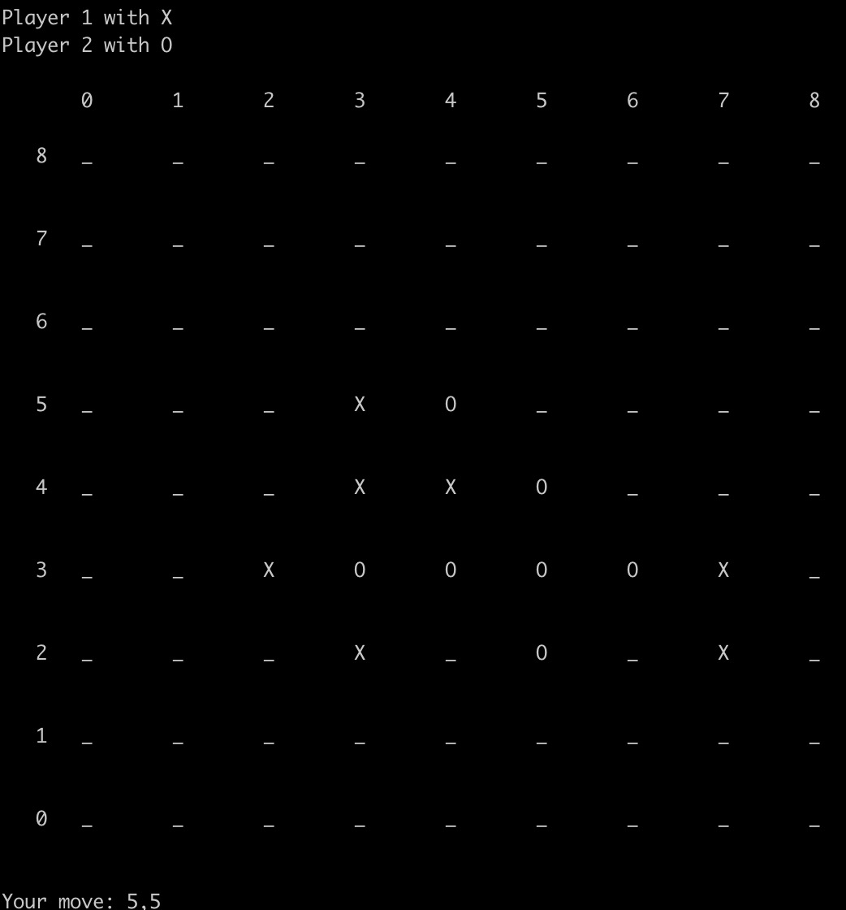

# Gomoku Genius: AI Search Strategies for Classic Board Game Mastery

## Table of Contents
1. [Introduction](#introduction)
2. [Goals](#goals)
3. [File Structure](#file-structure)
4. [Usage Instructions](#usage-instructions)
5. [AI Agents](#ai-agents)
6. [Run Examples](#run-examples)

## Introduction

[Gomoku](https://en.wikipedia.org/wiki/Gomoku), a well-known board game, is the focus of this project. The aim is to implement an Intelligent Agent for Gomoku that operates without forbidden moves, leveraging various AI search strategies.

## Goals

- Implement the basic minimax search for two-player zero-sum games.
- Develop pruning methods, such as alpha-beta search.
- Design and implement an evaluation function for guided search.
- Implement Monte Carlo Tree Search (MCTS).
- Explore the principles of AlphaZero with basic implementations.

## File Structure

- `minimax.py`: Minimax search method implementation.
- `mcts.py`: MCTS search method implementation.
- `alphazero.py`: AlphaZero concept implementation.
- `evaluation.py`: Evaluation function implementation.
- `game.py`: Script to run the game.

## Usage Instructions

To play Gomoku, navigate to the project directory and run:

```bash
python play.py
```



Game Rules: Input coordinates `A,B` to place a piece at row A and column B. Winning is achieved by connecting five pieces in a row.

For more detailed parameter information:
```
python play.py --help
```

## AI Agents
The project includes the following AI agents:

`DummyPlayer`: Automatically places a piece at the first available position.
`MinimaxSearchPlayer`: Implements the Minimax search strategy.
`AlphaBetaSearchPlayer`: Utilizes the Alpha-Beta pruning method.
`CuttingOffAlphaBetaSearchPlayer`: Alpha-Beta search with evaluation function.
`MCTSPlayer`: Implements MCTS.
`AlphaZeroPlayer`: Based on the AlphaZero concept.

## Run examples
To play against an AI agent:
```
python play.py --player_1 Human --player_2 DummyPlayer
python play.py --player_1 DummyPlayer --player_2 Human
```
To test AI agents against each other:
```
python play.py --width 3 --height 3 --n_in_row 3 --player_1 MinimaxSearchPlayer --player_2 Human
python play.py --player_1 MinimaxSearchPlayer --player_2 Human
python play.py --player_1 AlphaBetaSearchPlayer --player_2 Human
python play.py --player_1 CuttingOffAlphaBetaSearchPlayer --player_2 Human --max_depth 1 --evaluation_func detailed_evaluation_func
python play.py --player_1 CuttingOffAlphaBetaSearchPlayer --player_2 MCTSPlayer --evaluation_func detailed_evaluation_func
```


